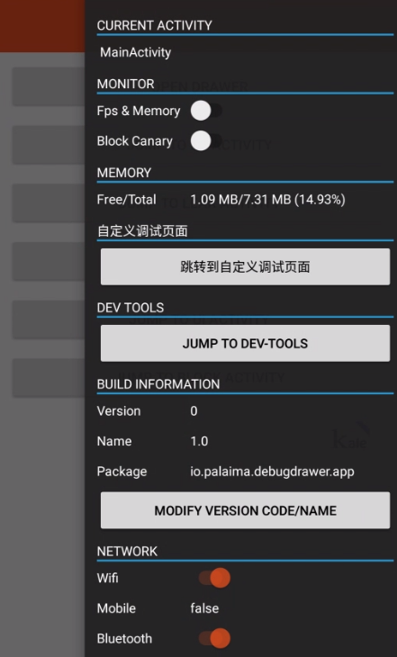
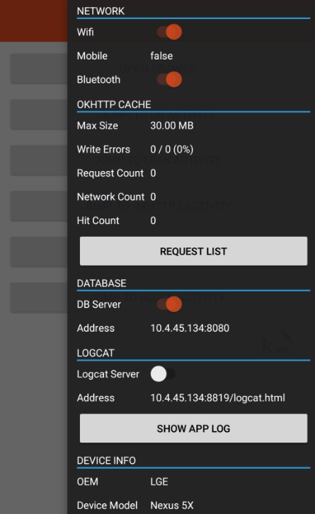
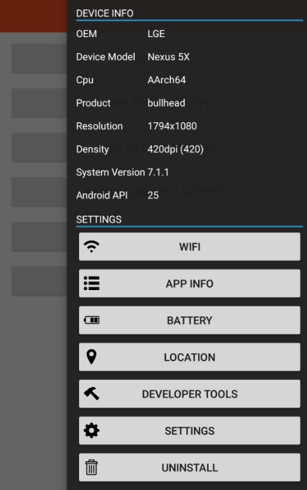

# Android Debug Drawer

[](https://gitter.im/palaima/DebugDrawer?utm_source=badge&utm_medium=badge&utm_campaign=pr-badge&utm_content=badge)

[](http://android-arsenal.com/details/1/1892)

Faster development with Debug Drawer





Android App进程的内存使用是有限制的，通过以下两个方法可以查看App可用内存的大小：

ActivityManager.getMemoryClass()获得正常情况下可用内存的大小
ActivityManager.getLargeMemoryClass()可以获得开启largeHeap最大的内存大小

## Add Gradle dependencies:

#### `DebugDrawer`
```gradle
dependencies {
   debugCompile 'io.palaima.debugdrawer:debugdrawer:0.7.0'
   releaseCompile 'io.palaima.debugdrawer:debugdrawer-no-op:0.7.0'
}
```

#### `optional`

```gradle
    compile 'com.amitshekhar.android:debug-db:1.0.0'
    compile 'com.github.tianzhijiexian:Logcat:1.0.7'
    compile 'com.github.simonpercic:oklog3:2.1.0'
    compile 'com.github.markzhai:blockcanary-android:1.5.0'
    compile 'com.github.xcc3641:watcher:0.5'
```

https://github.com/amitshekhariitbhu/Android-Debug-Database  
https://github.com/tianzhijiexian/Logcat    
https://github.com/markzhai/AndroidPerformanceMonitor  
https://github.com/xcc3641/Watcher  
https://github.com/simonpercic/OkLog

## Initialization in Application

```java
    // create a okhttp3 client...
    // dependent on com.github.simonpercic:oklog3:2.1.0
    okHttpClient = DebugDrawer.createOkLogHttpClient(okHttpClient); 

    DebugDrawer.init(this, new DebugDrawer.Config() {
        @Override
        protected List<IDebugModule> getModules() {
            return new ArrayList<IDebugModule>(Arrays.asList(
                    new ActivityModule(),
                    new MonitorModule(), // dependent on com.github.xcc3641:watcher:0.5
                    new MemoryModule(),
                    new CustomDevModule(), // custom module
                    new DevToolsModule(),
                    new BuildModule(),
                    new NetworkModule(),
                    new OkHttp3Module(okHttpClient), // dependent on com.squareup.okhttp3:okhttp:3.1.2
                    new DataBaseModule(), // dependent on com.amitshekhar.android:debug-db:1.0.0
                    new LogcatModule(), // dependent on com.github.tianzhijiexian:Logcat:1.0.7
                    new DeviceModule(),
                    new SettingsModule()
            ));
        }
    });
```

License
--------

    Copyright 2016 Mantas Palaima.

    Licensed under the Apache License, Version 2.0 (the "License");
    you may not use this file except in compliance with the License.
    You may obtain a copy of the License at

       http://www.apache.org/licenses/LICENSE-2.0

    Unless required by applicable law or agreed to in writing, software
    distributed under the License is distributed on an "AS IS" BASIS,
    WITHOUT WARRANTIES OR CONDITIONS OF ANY KIND, either express or implied.
    See the License for the specific language governing permissions and
    limitations under the License.
